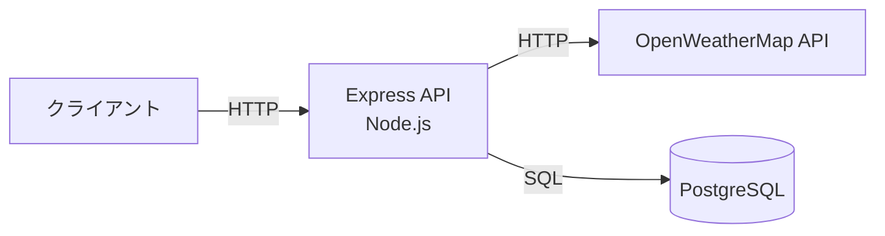
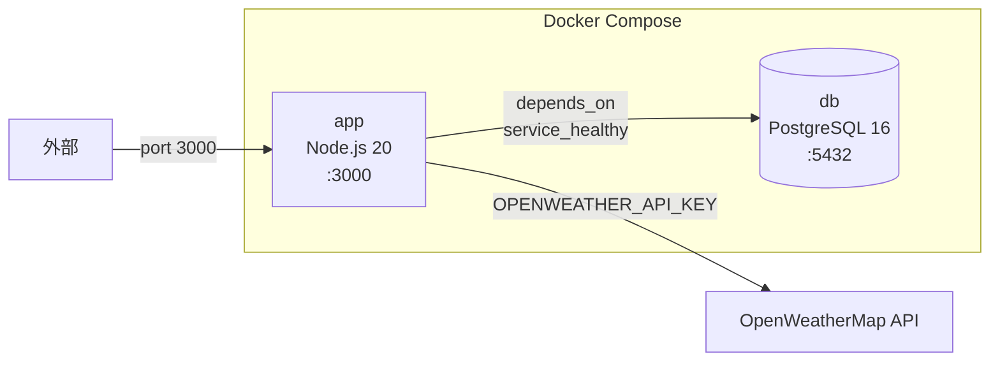
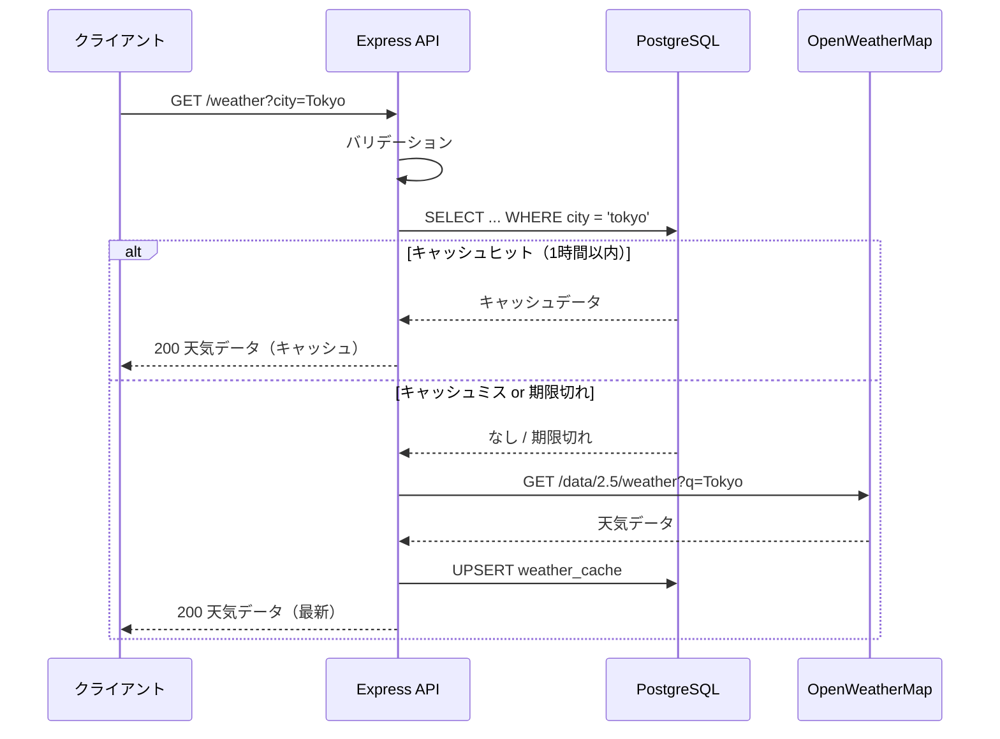
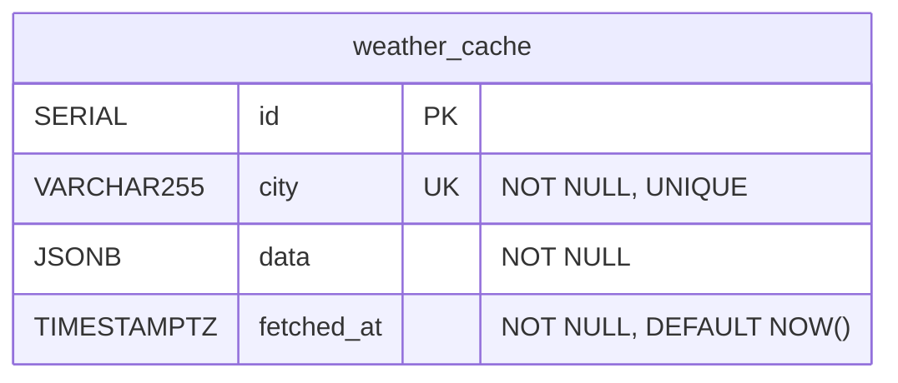
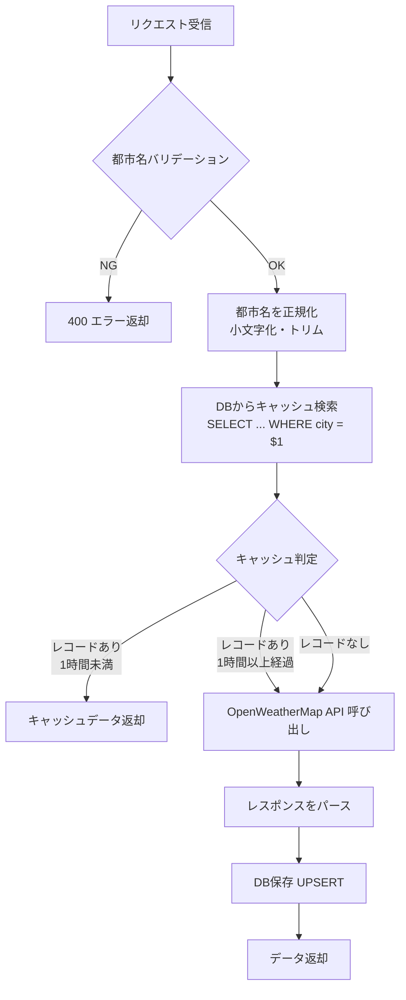
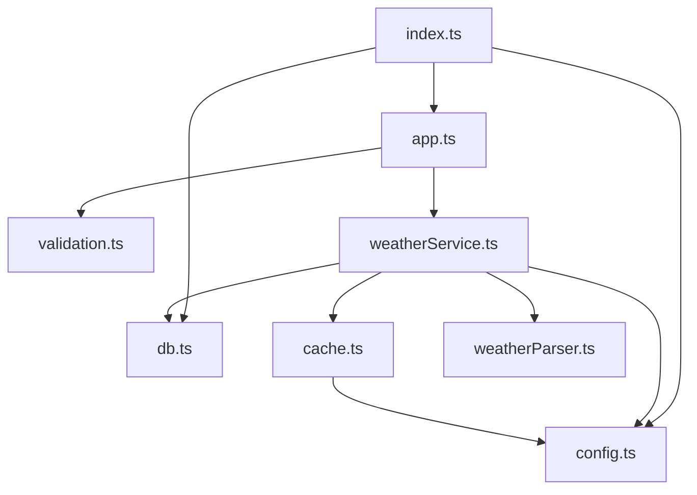

# 天気情報キャッシュAPI 設計書

## 1. 概要

OpenWeatherMap API から天気情報を取得し、PostgreSQL にキャッシュして返す REST API。
同一都市への問い合わせが1時間以内の場合はキャッシュ済みデータを返し、外部APIコールを節約する。

## 2. システム構成



### Docker Compose 構成



| サービス | イメージ | ポート | 役割 |
|---------|---------|-------|------|
| `app` | カスタムビルド (Node.js 20) | 3000 | Express API サーバー |
| `db` | postgres:16-alpine | 5432 | キャッシュ用データベース |

## 3. API 仕様

### GET /weather

天気情報を取得する。



| 項目 | 内容 |
|------|------|
| メソッド | GET |
| パス | `/weather` |
| クエリパラメータ | `city` (必須) — 都市名（英語、アルファベット・スペース・ハイフン・アポストロフィのみ） |

#### リクエスト例

```
GET /weather?city=Tokyo
```

#### 正常レスポンス (200)

```json
{
  "city": "Tokyo",
  "temperature": 20.5,
  "feelsLike": 19.8,
  "humidity": 65,
  "description": "clear sky",
  "windSpeed": 3.5,
  "icon": "01d"
}
```

#### レスポンスフィールド

| フィールド | 型 | 説明 |
|-----------|-----|------|
| `city` | string | 都市名 |
| `temperature` | number | 気温（℃） |
| `feelsLike` | number | 体感温度（℃） |
| `humidity` | number | 湿度（%） |
| `description` | string | 天気の説明（英語） |
| `windSpeed` | number | 風速（m/s） |
| `icon` | string | 天気アイコンコード |

#### エラーレスポンス

| ステータス | 条件 | レスポンス例 |
|-----------|------|-------------|
| 400 | 都市名が未指定・空文字・不正な文字を含む | `{"error": "City name is required"}` |
| 400 | 都市名が100文字超 | `{"error": "City name is too long"}` |
| 400 | 数字や記号を含む | `{"error": "City name contains invalid characters"}` |
| 404 | OpenWeatherMap に都市が存在しない | `{"error": "City not found"}` |
| 500 | 外部API障害・DB障害等 | `{"error": "Failed to fetch weather data"}` |

## 4. データベース設計

### ER図



### テーブル: `weather_cache`

| カラム | 型 | 制約 | 説明 |
|--------|-----|------|------|
| `id` | SERIAL | PRIMARY KEY | 自動採番ID |
| `city` | VARCHAR(255) | NOT NULL, UNIQUE | 都市名（正規化済み: 小文字・トリム済み） |
| `data` | JSONB | NOT NULL | 天気データ（WeatherData 型の JSON） |
| `fetched_at` | TIMESTAMP WITH TIME ZONE | NOT NULL, DEFAULT NOW() | 取得日時 |

#### インデックス

- `city` カラムに UNIQUE 制約（暗黙的にインデックス作成）

#### UPSERT 戦略

新規取得時は `INSERT ... ON CONFLICT (city) DO UPDATE` で、既存レコードがあれば `data` と `fetched_at` を更新する。

## 5. キャッシュ戦略



### キャッシュ有効期間

- **TTL**: 1時間（3,600,000 ミリ秒）
- `config.cacheTtlMs` で設定（`src/config.ts`）
- 判定ロジック: `現在時刻 - fetched_at < cacheTtlMs`

## 6. モジュール構成

```
src/
├── index.ts          # エントリーポイント（サーバー起動・DB初期化）
├── app.ts            # Express アプリケーション（ルーティング・エラーハンドリング）
├── config.ts         # 環境変数の読み込み・設定オブジェクト
├── db.ts             # PostgreSQL 接続プール管理・テーブル初期化
├── cache.ts          # キャッシュ有効期限の判定ロジック
├── validation.ts     # 都市名のバリデーション
├── weatherParser.ts  # OpenWeatherMap レスポンスのパース・型定義
└── weatherService.ts # 天気データ取得（キャッシュ確認 → API呼び出し → DB保存）
```

### モジュール依存関係



### 各モジュールの責務

| モジュール | 責務 |
|-----------|------|
| `index.ts` | アプリケーション起動。DB初期化後に Express サーバーをリッスン開始 |
| `app.ts` | HTTP リクエストの受付。バリデーション → サービス呼び出し → レスポンス返却 |
| `config.ts` | `.env` ファイルの読み込み。環境変数を型付きオブジェクトとして提供 |
| `db.ts` | PostgreSQL 接続プールのシングルトン管理。`weather_cache` テーブルの自動作成 |
| `cache.ts` | キャッシュの有効・無効を判定する純粋関数 |
| `validation.ts` | 都市名の入力チェック（必須・長さ・許可文字パターン） |
| `weatherParser.ts` | OpenWeatherMap API レスポンスを `WeatherData` 型に変換。型定義も提供 |
| `weatherService.ts` | ビジネスロジックの中核。キャッシュ確認 → API呼び出し → DB保存の一連のフロー |

## 7. 環境変数

| 変数名 | 必須 | デフォルト | 説明 |
|--------|------|-----------|------|
| `OPENWEATHER_API_KEY` | はい | (なし) | OpenWeatherMap API キー |
| `PORT` | いいえ | `3000` | サーバーのリッスンポート |
| `DB_HOST` | いいえ | `localhost` | PostgreSQL ホスト名 |
| `DB_PORT` | いいえ | `5432` | PostgreSQL ポート |
| `DB_USER` | いいえ | `postgres` | PostgreSQL ユーザー名 |
| `DB_PASSWORD` | いいえ | `postgres` | PostgreSQL パスワード |
| `DB_NAME` | いいえ | `weather_cache` | PostgreSQL データベース名 |

## 8. テスト設計

### ユニットテスト

| テストファイル | 対象モジュール | テスト内容 |
|-------------|-------------|-----------|
| `tests/unit/cache.test.ts` | `cache.ts` | キャッシュ有効期限判定（1時間以内→true、ちょうど1時間→false、超過→false） |
| `tests/unit/weatherParser.test.ts` | `weatherParser.ts` | 正常パース、null入力、必須フィールド欠落時のエラー |
| `tests/unit/validation.test.ts` | `validation.ts` | 正常な都市名、空文字、長すぎる名前、不正文字のバリデーション |

### 結合テスト

| テストファイル | テスト内容 |
|-------------|-----------|
| `tests/integration/weather.test.ts` | エンドポイントの正常系・異常系テスト |

| テストケース | 検証内容 |
|------------|---------|
| 有効な都市名でリクエスト | 200 レスポンスと天気データの返却 |
| 同一都市への2回目のリクエスト | サービス関数が呼ばれ、レスポンスが返ること |
| 都市名パラメータ未指定 | 400 エラー |
| 不正な都市名 | 400 エラー |
| 外部 API で都市が見つからない | 404 エラー |
| 外部 API 障害 | 500 エラー |

### テスト方針

- 外部 API（OpenWeatherMap）の呼び出しは全てモックする
- 結合テストでは `weatherService.getWeather` をモックし、Express のルーティング〜レスポンスを検証
- `npm test` で全テスト（ユニット + 結合）を一括実行

## 9. デプロイ・起動手順

### Docker Compose（推奨）

```bash
cp .env.example .env
# .env の OPENWEATHER_API_KEY を設定
docker compose up
```

### ローカル開発

```bash
npm install
cp .env.example .env
# .env の OPENWEATHER_API_KEY と DB_* を設定
# PostgreSQL を別途起動しておく
npm run dev
```

## 10. 技術スタック

| カテゴリ | 技術 | バージョン |
|---------|------|-----------|
| ランタイム | Node.js | 20 |
| フレームワーク | Express | ^4.21.0 |
| 言語 | TypeScript | ^5.5.0 |
| データベース | PostgreSQL | 16 |
| DB クライアント | pg (node-postgres) | ^8.13.0 |
| HTTP クライアント | axios | ^1.7.0 |
| 環境変数 | dotenv | ^16.4.0 |
| テスト | Jest + ts-jest | ^29.7.0 |
| HTTP テスト | supertest | ^7.0.0 |
| リンター | ESLint + @typescript-eslint | ^8.57.0 |
| コンテナ | Docker Compose | v2 |
